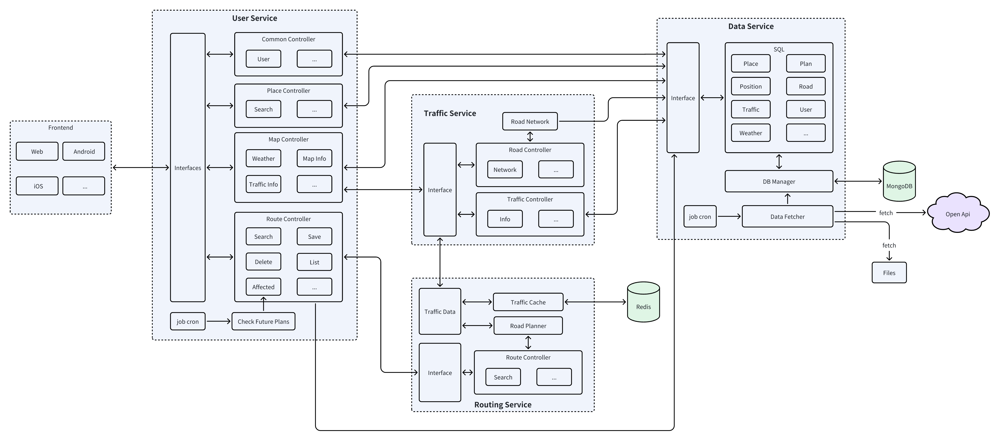

# Turin Go Backend 🚦🌐
TurinGO – Urban Trip Planning in Turin

  

---
## 🔗 Repositories
- **[Frontend Code](https://github.com/UrbanTripPlanning/turin_go_frontend)**
- **[Backend Code](https://github.com/UrbanTripPlanning/turin_go_backend)** (Current Repository)
- **[Model training and testing](https://github.com/UrbanTripPlanning/trip_planner)**

---
### University
Politecnico di Torino / Polytechnic University of Turin

### Course
Master of Science program in ICT for Smart Societies

03QWZBH - Interdisciplinary projects

---
## 📖 Introduction
TurinGO is an intelligent trip planning app designed to improve urban mobility in the city of Turin. TurinGO leverages real-time data and advanced routing algorithms to offer optimal paths based on distance, time, or predicted traffic conditions.
This project was developed as part of the Interdisciplinary Project course at Politecnico di Torino, combining urban mobility analysis, geographic information systems (GIS), and smart routing strategies.

---
## 🚀 Features
- 🚦 **Traffic Prediction**
We address the challenge of forecasting future travel times on individual road segments by learning a compact embedding that captures both the intrinsic properties of each segment (length, speed, nominal travel time) and its local network context.
The encoder is built on a Graph Convolutional Network (GCN) framework, which generalizes classical convolution to irregular graphs by aggregating neighborhood features through learned filter weights.
The resulting scalar embeddings serve as edge weights in classical shortest path algorithms, enabling route generation that minimizes context-aware predicted travel time.

- 🧭 **Route Planning**
Building on traffic prediction, we construct a directed graph using networkx that incorporates road segments, speed, and traffic conditions.
The A* algorithm is then applied to compute fast and real-time routes.

- 🗂️ **Multi-Version Time-Sliced Caching Mechanism**
Constructing traffic network graphs from raw traffic data is time-consuming and can significantly degrade system performance, especially under high-frequency routing queries.
To address this, we implement a multi-version, time-sliced caching mechanism with periodic updates.

- 🔔 **Impact-Aware Planning**
A scheduled task periodically checks for significant deviations in the planned future travel time and maintains this information in the cache.
Notifications are then sent to users through specific mechanisms when notable changes are detected.

- ⏱️ **Scheduled Data Collection**
Traffic and weather data are collected on a scheduled basis and normalized before being stored in the database.

---
## 🛠️ Technology Stack
- **Language & Framework**: Python 3.11+, FastAPI, Uvicorn
- **Database**: MongoDB
- **Graph Library**: NetworkX
- **HTTP Client**: HTTPX
- **Containerization**: Docker & Docker Compose
- **Machine Learning**: GCN

---

## 🏗️ Architecture

---
## ✍️ Teams
- Lai Wenxi
- Shaterzadeh Davood
- Reitano Marzio
- Fida Riccardo
- Naeimi Habibollah

---

## License
[MIT license](LICENSE)

